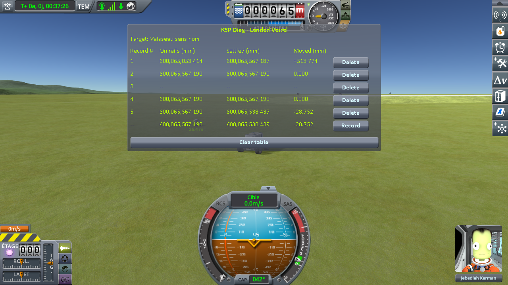

# The measurements: coming back to a craft you left

Part of [KSP Diag - Landed Vessel](../README.md): the readings taken with
[the approach protocol](the-protocol-approach.md) — a craft parked on flat ground, a rover driving
away until the game unloads it, then coming back. Nothing is loaded at any point: from the first line
to the last, it is one single flight.

The save the protocol uses is [`diag/approach-kerbin.sfs`](../diag/approach-kerbin.sfs), and
[the protocol page](the-protocol-approach.md#the-save) says what it holds.

## The install

KSP 1.12.5 on Windows, with `GameData` holding Harmony, ModuleManager,
[KSP Community Fixes](https://github.com/KSPModdingLibs/KSPCommunityFixes) 1.41.1, this mod,
[KSP Diag - Terrain Height](https://github.com/lhervier/KSP-Diag-TerrainHeight), which reads the ground
under the parked craft at the same moments, and [KSP-MCPServer](https://github.com/lhervier/KSP-MCPServer),
which drives the rover, and nothing else.

The six round trips were played by [the script of the protocol](the-protocol-approach.md#played-by-a-script),
`run-approach.py`.

## The readings

Six round trips in a row, in one flight. The table was cleared between them, so each screenshot holds
one round trip and its first line is the last line of the one before. The bottom line of each is the
reading in progress, not a record.

| round trip | **Moved** | screenshot |
|---|---|---|
| 1 | **−28.752 mm** | [`run1.png`](../imgs/measures/approach/run1.png) |
| 2 | **+6.619 mm** | [`run2.png`](../imgs/measures/approach/run2.png) |
| 3 | **−24.666 mm** | [`run3.png`](../imgs/measures/approach/run3.png) |
| 4 | **+34.263 mm** | [`run4.png`](../imgs/measures/approach/run4.png) |
| 5 | **+6.758 mm** | [`run5.png`](../imgs/measures/approach/run5.png) |
| 6 | **−37.177 mm** | [`run6.png`](../imgs/measures/approach/run6.png) |

The round trip pictured under the protocol, taken by hand in another flight of the same save, read
−17.572 mm.

The first line of the first screenshot is not a round trip: it is the scene opening, the craft handed
back by the save and coming to rest 513.774 mm higher than the save held it. That is the reading
[the loading series](the-measurements-loading.md) is about, and it is left aside here.

## What these readings show

**The game gives the craft back where it took it.** Lines 2 and 4 of every round trip — before the
trip and after it — never differ by more than a thousandth of a millimetre. Whatever happened
while the rover was away, the height the game holds the craft at came back untouched.

**What it comes to rest on is somewhere else.** Once physics takes it over again, it settles between
6.6 and 37.2 mm from that height, upwards as often as downwards, and a different amount every time.

**Nothing was loaded.** No scene change, no save, no quickload: the whole table was filled in one
flight, by driving away and coming back.

The size is not the same from one round trip to the next, and it is not guaranteed either: we have
seen a round trip come back within a millimetre. That is why the protocol asks for a series.

As everywhere else with this instrument, what is measured is **the craft**, not the ground it rests
on — [what this instrument shows, and what it does not](this-mods-demonstration.md#what-this-instrument-shows-and-what-it-does-not) applies
to these readings word for word.

## The logs

[`diag/runs/approach-stock.log`](../diag/runs/approach-stock.log) — the `KSP.log` of the session the six
round trips were taken in; what the script printed is in
[`approach-stock-script.txt`](../diag/runs/approach-stock-script.txt), and every line it recorded, in
both instruments, in [`approach-stock-lines.json`](../diag/runs/approach-stock-lines.json).
