# The measurements: loading the same save

Part of [Terrain Precision Fix Diag 1](../README.md): the readings taken with
[the loading protocol](the-protocol-loading.md), on the four worlds of stock KSP and on two much
larger ones, the Moon and Earth of Real Solar System. The other series are in
[The measurements: coming back to a craft you left](the-measurements-approach.md) and
[The measurements: switching to a craft far away](the-measurements-switching.md).

## The install

KSP 1.12.5 on Windows, with `GameData` holding Harmony, ModuleManager,
[KSP Community Fixes](https://github.com/KSPModdingLibs/KSPCommunityFixes) 1.41.1 and this mod, and
nothing else — what most players run, give or take their other mods.

The Moon and Earth are measured on an install of their own: the one above, plus
[Real Solar System](https://github.com/KSP-RO/RealSolarSystem) 20.1.3.0 and what it requires
(Kopernicus, Modular Flight Integrator, KSPTextureLoader, the RSS textures). Real Solar System replaces
the planets with the real ones: the Moon is more than three times the radius of Kerbin, Earth more than
ten times. It is installed as released, and it ships a workaround of its own that moves landed craft
at loading; what that does to the readings is in
[Real Solar System's own workaround](#real-solar-systems-own-workaround). The saves are in
[`diag`](../diag/README.md#on-real-solar-system); they only load there.

## One capsule

That is the whole demonstration, and it fits in one screenshot. Here is the same save, on Kerbin,
loaded six times:

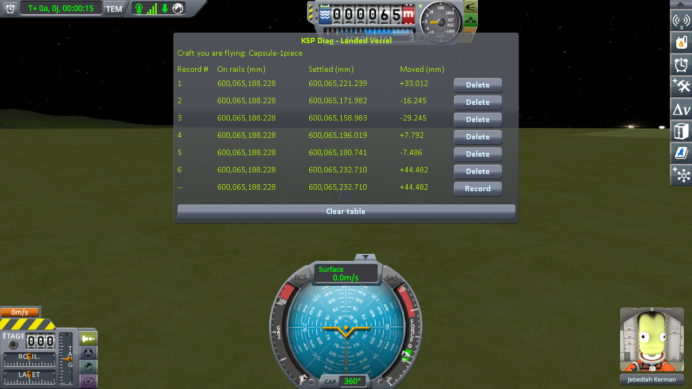

The bottom line is the loading in progress, not a seventh one: after the sixth *Record*, it keeps
showing that same sixth loading, still live.

The same value in **On rails**, six times over: KSP handed the capsule back in exactly the same
place, every single time. Never a zero in **Moved**: on all six, the ground turned out to be
somewhere else. Sometimes lower, and the capsule dropped onto it; sometimes higher, and it got pushed
back out.

The same lone capsule, the same loadings of one save, done again on the Mun, on Minmus and on
Gilly — the smallest place there is to stand on:

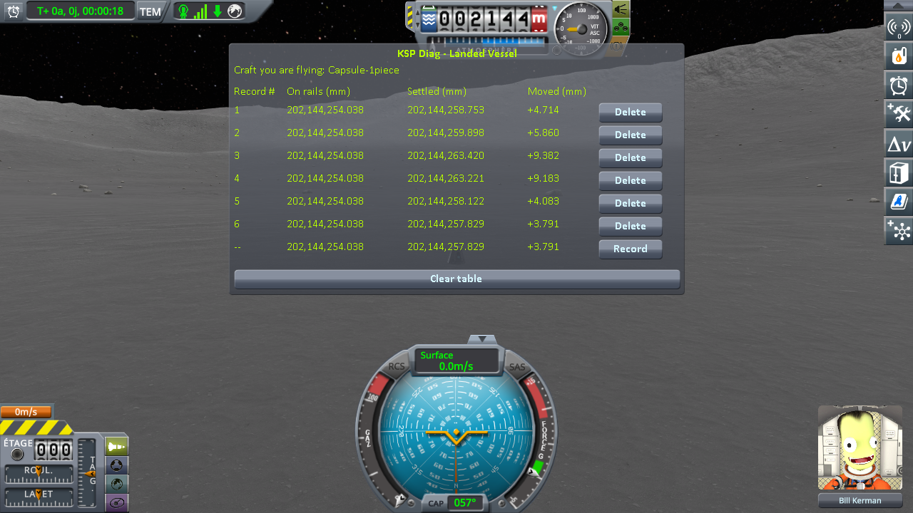

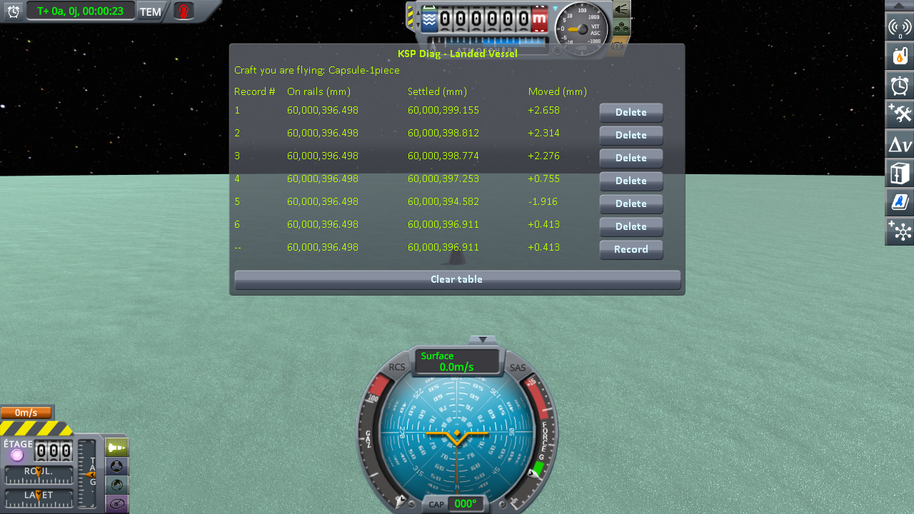

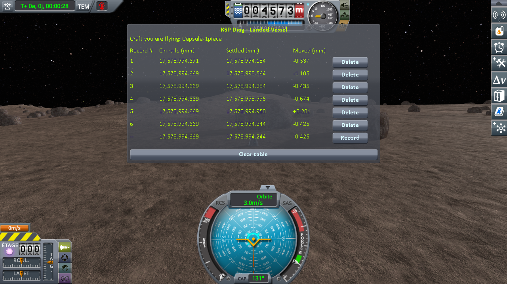

| loading | Kerbin — **Moved** (mm) | Mun — **Moved** (mm) | Minmus — **Moved** (mm) | Gilly — **Moved** (mm) |
|---|---|---|---|---|
| 1 | −24.047 | −5.056 | −2.921 | +2.427 |
| 2 | +42.074 | +15.368 | −1.736 | −0.131 |
| 3 | +51.180 | +2.385 | +0.333 | +1.664 |
| 4 | +7.070 | −2.290 | −1.525 | −0.846 |
| 5 | −33.097 | −5.287 | +0.069 | +0.499 |
| 6 | +101.430 | +5.555 | +3.785 | +0.595 |
| **lowest to highest** | **134.5 mm** | **20.7 mm** | **6.7 mm** | **3.3 mm** |

## The same craft, with two parts

A craft made of a single part is a special case for KSP (see [the protocol](the-protocol-loading.md)).
So the whole campaign was run again with a two-part craft: the same capsule, sitting on a small flat
fuel tank. The Moon and Earth were measured with this craft only: on flat ground on the Moon,
`reload-moon-rss.sfs`, and on the grass about 1.4 km west of the KSC on Earth,
`reload-earth-rss-resave.sfs`.

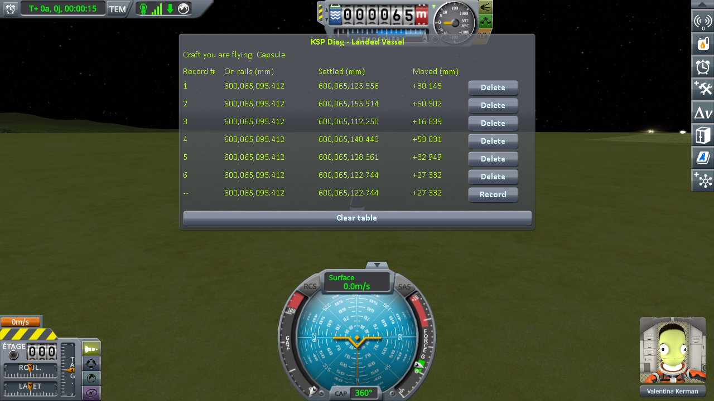

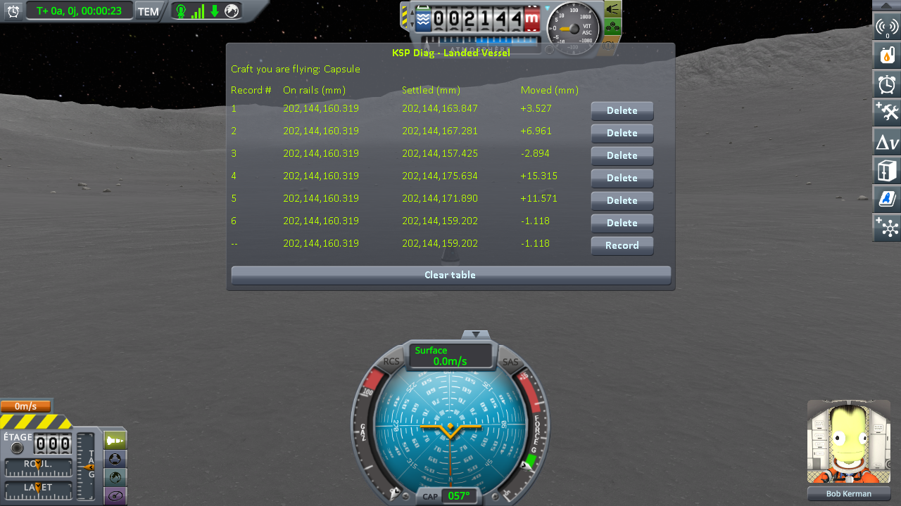

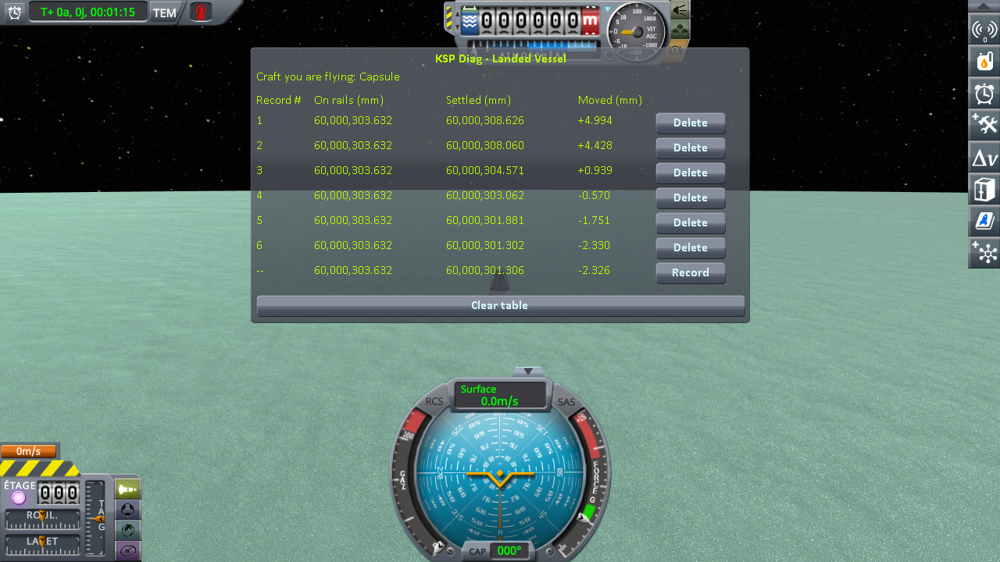

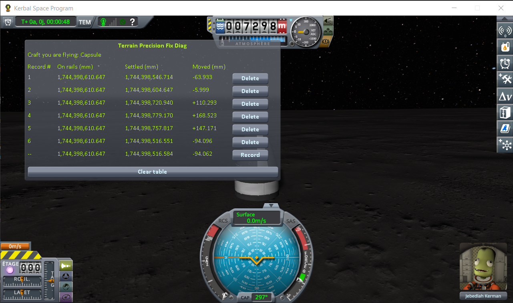

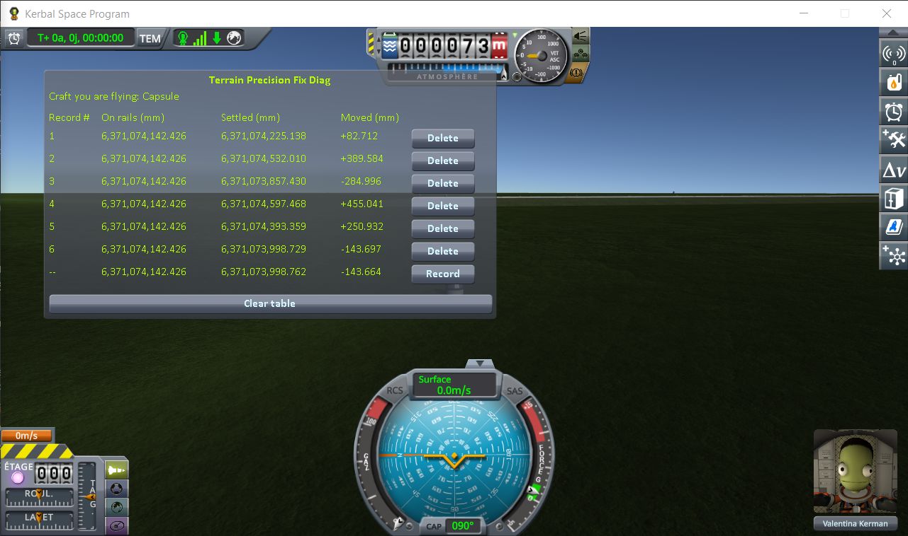

| loading | Kerbin — **Moved** (mm) | Mun — **Moved** (mm) | Minmus — **Moved** (mm) | Gilly — **Moved** (mm) | the Moon — **Moved** (mm) | Earth — **Moved** (mm) |
|---|---|---|---|---|---|---|
| 1 | +76.134 | −5.641 | +0.392 | +2.007 | −63.933 | +82.712 **(jumped)** |
| 2 | +77.214 | −4.935 | +3.263 | −0.073 | −5.999 | +389.584 *(moved up)* |
| 3 | −25.810 | +6.147 | −1.084 | +0.499 | +110.293 *(moved up)* | −284.996 *(moved down)* |
| 4 | +56.322 | +2.259 | +0.800 | +1.008 | +168.523 *(moved up)* | +455.041 *(moved up)* |
| 5 | −1.187 | −2.629 | +1.627 | −0.150 | +147.171 *(moved up)* | +250.932 *(moved up)* |
| 6 | −47.450 | −1.216 | −1.514 | −0.468 | −94.096 | −143.697 *(moved down)* |
| **lowest to highest** | **124.7 mm** | **11.8 mm** | **4.8 mm** | **2.5 mm** | **262.6 mm** | **740.0 mm** |

*(moved up)*, *(moved down)*: the craft came back more than 10 cm inside the ground, or more than 10 cm
above it, and was moved onto it before its physics started, with a `Moving Vessel up` or
`Moving Vessel down` line in `KSP.log` giving about the same distance. The protocol asks for loadings
without such a line; on Real Solar System they cannot all be avoided, so the lines are kept, and marked.
Who moves the craft, and why, is in
[Real Solar System's own workaround](#real-solar-systems-own-workaround). **(jumped)**: the craft was
seen to jump.

The sessions are logged in [`diag/runs`](../diag/README.md#on-real-solar-system).

## Real Solar System's own workaround

**Real Solar System already moves landed craft at loading.** It ships a component,
`VesselGroundPositionEnhancer`, which runs the stock repositioning pass on every landed craft it
unpacks: a craft found more than 10 cm off the ground, inside it or above it, is moved onto it before
its physics starts, in one block, and `KSP.log` gets a `Moving Vessel` line. Under 10 cm, the pass
leaves the craft where it is, inside the ground or not. The component only acts on a *landed* craft. On
Earth, near the KSC, the craft is in the *prelaunch* situation instead, where the component does not
run; there, stock KSP runs the same pass on its own, at every loading, which is what moved the craft at
five of the six loadings above, three times up and twice down. The component turns itself off when an assembly named `WorldStabilizer` is loaded.

**Loading again and again.** The same save of the Moon, `reload-moon-rss.sfs`, loaded again and again,
watching the craft rather than the numbers — fourteen loadings, all recorded:

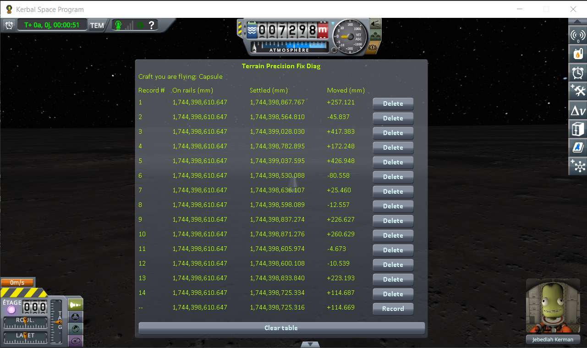

| loading | **Moved** (mm) | what the craft did |
|---|---|---|
| 1 | +257.121 | moved up by the pass (`0.257m`) |
| 2 | −45.837 | nothing |
| 3 | +417.383 | **tipped over** |
| 4 | +172.248 | moved up by the pass (`0.173m`) |
| 5 | +426.948 | **tipped over** |
| 6 | −80.558 | nothing |
| 7 | +25.460 | **jumped** |
| 8 | −12.557 | nothing |
| 9 | +226.627 | moved up by the pass (`0.227m`) |
| 10 | +260.629 | moved up by the pass (`0.261m`) |
| 11 | −4.673 | nothing |
| 12 | −10.539 | nothing |
| 13 | +223.193 | moved up by the pass (`0.223m`) |
| 14 | +114.687 | moved up by the pass (`0.115m`) |
| **lowest to highest**, the twelve loadings where the craft stayed upright | **341.2 mm** | |

Where the craft tipped over, **Moved** reads the height of a craft lying on its side, not one that
settled: those two lines are left out of the spread.

**With the component turned off**, by an empty assembly named `WorldStabilizer` in `GameData`, the first
loading of the same save was enough:

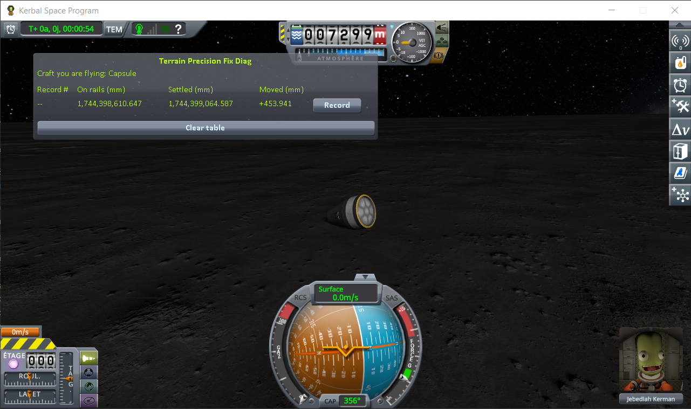

**With the component on, the craft can tip over too.** At the third and fifth of the fourteen loadings
above; and twice more on the same craft saved again at a later load, `reload-moon-rss-resave.sfs`, Real
Solar System as released: at the first loading of one session, and at the fourth of the six loadings
[Terrain Precision Fix Diag 2](https://github.com/lhervier/KSP-TerrainPrecisionFixDiag2/blob/master/docs/the-measurements-loading.md#the-readings)
measured on the Moon. Each time, `KSP.log` shows the component running
(`[RSS-VGPE] CheckGroundCollision()`) and no `Moving Vessel` line: the craft came back less than
10 cm off the ground, and the pass left it where it was. Here is the third of the fourteen loadings,
after its *Record*:

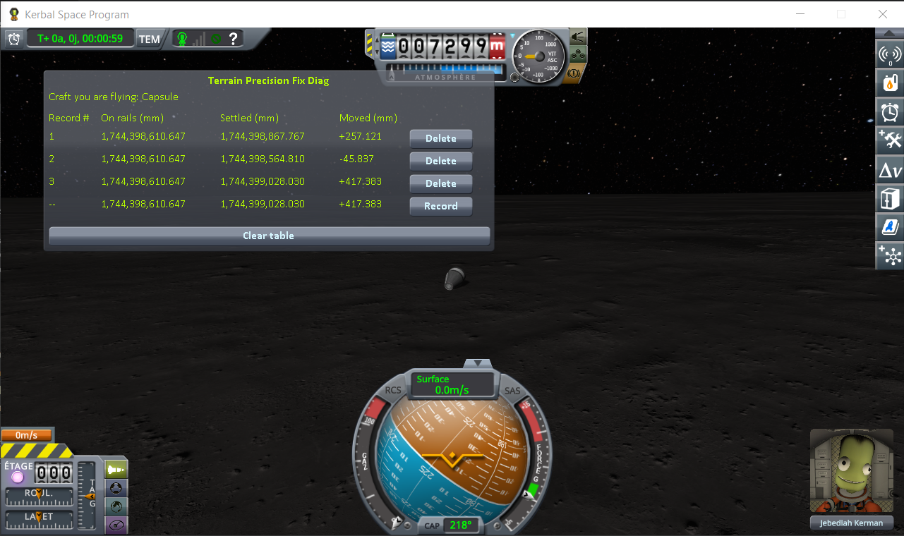

**The component is indispensable, and it is not enough.** Indispensable: over the twenty loadings of
`reload-moon-rss.sfs`, it moved the craft nine times, each time from 11 to 26 cm inside the ground; with
it turned off, the very first loading tipped the craft over. Not enough: it only acts beyond 10 cm,
while on the Moon the ground comes back over 26 to 34 cm from one loading to the next, which leaves
plenty of room below it — of the fourteen loadings watched, one still made the craft jump and two
tipped it over, and, on the save taken again, the craft tipped over twice more. On Earth, stock's own pass
let one jump through in six loadings, for the same reason. And where either pass does
act, it does not put the craft back where it was saved: it moves the whole of it, up or down, in one
block, onto a ground that came back somewhere else.

The sessions are logged in [`diag/runs`](../diag/README.md#on-real-solar-system); the session of the
first tip-over with the component on, in `reload-moon-rss-stock-tipped.log`, and the six loadings of
Diag 2 on the Moon in
[Diag 2's `diag/runs`](https://github.com/lhervier/KSP-TerrainPrecisionFixDiag2/tree/master/diag/runs),
file `reload-moon-rss-stock.log`.

## What the numbers say

**On rails** gives the same digits on every line of every series, on the six bodies, with two exceptions
of a few thousandths of a millimetre: with one part, the first loading on Gilly reads three thousandths
above the five others; with two parts, the first loading on Kerbin reads two thousandths below. So
everywhere, KSP handed the craft back where the save says it was.

**Settled** did not come back once. On every body, the craft came to rest at a height that changed from
one loading to the next, and the larger the world, the larger the spread: 3.3 mm on Gilly, 6.7 mm on
Minmus, 20.7 mm on the Mun, 134.5 mm on Kerbin with one part (2.5 to 124.7 mm with two, the same
picture), then 262.6 to 341.2 mm on the Moon of Real Solar System and 740.0 mm on its Earth. Smaller
world, smaller spread, but never none.

**On the large worlds, the spread is enough to make a craft jump, and the Moved column shows when.** It sorts
every loading into one of three cases. Wherever the ground came back more than 10 cm away from the
craft, higher or lower, the repositioning pass moved the craft onto it, up or down, before its physics
started: nothing was seen to move. Wherever the ground came back lower by less than that, the craft
dropped onto it. And wherever it came back higher by less than that — the craft a few centimetres
inside it, under the 10 cm the pass acts on — the physics engine pushed it out: two jumps and two
tip-overs in the twenty loadings watched for them, fourteen on the Moon and six on Earth, two more
tip-overs on the save of the Moon taken again, and, with the pass turned off, a craft tipped over at
the first loading. On the four worlds of stock KSP, the protocol keeps to loadings where the pass never runs, so
only the last two cases appear there.

**Real Solar System's workaround catches part of it, not all of it** — see
[Real Solar System's own workaround](#real-solar-systems-own-workaround).
