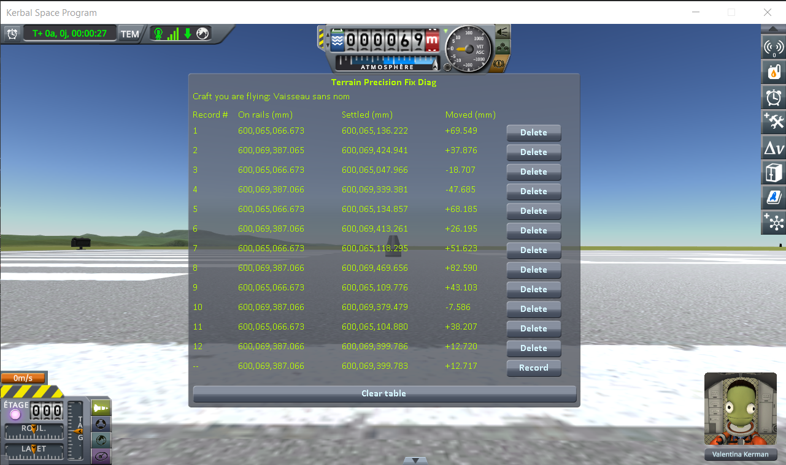

# The measurements: the runway and the grass beside it

Part of [Terrain Precision Fix Diag 1](../README.md): the readings taken with
[the runway protocol](the-protocol-runway.md) — two identical craft, one on the grass and one on the
runway, 152 m apart, both read at each of six loadings of the same save. The other series are in
[The measurements: loading the same save](the-measurements-loading.md),
[The measurements: coming back to a craft you left](the-measurements-approach.md) and
[The measurements: switching to a craft far away](the-measurements-switching.md).

The save the protocol uses is [`diag/runway-kerbin.sfs`](../diag/runway-kerbin.sfs), and
[the protocol page](the-protocol-runway.md#the-save) says what it holds.

## The install

KSP 1.12.5 on Windows, with `GameData` holding Harmony, ModuleManager,
[KSP Community Fixes](https://github.com/KSPModdingLibs/KSPCommunityFixes) 1.41.1 and this mod, and
nothing else.

## The readings

Six loadings, two lines each: the odd lines on the grass, the even lines on the runway, after
switching to it. The bottom line of the screenshot is the reading in progress, not a record.

**On rails** reads 600,065,066.673 mm on the grass at all six loadings, and 600,069,387.065 or .066 mm
on the runway. **Settled**, in millimetres, and the step between the two craft:

| loading | on the grass | on the runway | **step**: runway minus grass |
|---|---|---|---|
| 1 | 600,065,136.222 | 600,069,424.941 | 4,288.719 |
| 2 | 600,065,047.966 | 600,069,339.381 | 4,291.415 |
| 3 | 600,065,134.857 | 600,069,413.261 | 4,278.404 |
| 4 | 600,065,118.295 | 600,069,469.656 | 4,351.361 |
| 5 | 600,065,109.776 | 600,069,379.479 | 4,269.703 |
| 6 | 600,065,104.880 | 600,069,399.786 | 4,294.906 |
| **lowest to highest** | **88.3 mm** | **130.3 mm** | **81.7 mm** |

In *Moved*, the craft on the grass goes from −18.707 to +69.549 mm, the craft on the runway from −47.685
to +82.590 mm.

## What these readings show

**The game hands both craft back at the same height every time.** *On rails* does not move by more
than a thousandth of a millimetre on either of them.

**Both come to rest somewhere else every time.** The craft on the grass settles anywhere within
88.3 mm, as in [the loading series](the-measurements-loading.md). The craft on the runway does the same,
within 130.3 mm: standing on the runway deck rather than on the terrain changes nothing to that.

**The two do not move together.** The step between them — 4.3 m, the height of the runway deck above
the grass — is never the same twice: it spreads over 81.7 mm. The two craft are identical and both
stand on flat ground, so the step between them is the step between the grass and the runway. If the
runway kept the same height relative to the ground next to it, that step would not move. The runway and
the ground beside it do not keep their heights relative to each other.

As everywhere else with this instrument, what is measured is **the craft**, not what they rest on —
[what this instrument shows, and what it does not](this-mods-demonstration.md#what-this-instrument-shows-and-what-it-does-not)
applies to these readings word for word.

## The logs

[`diag/runs/runway-stock.log`](../diag/runs/runway-stock.log) — the `KSP.log` of the session the six
loadings were taken in.
