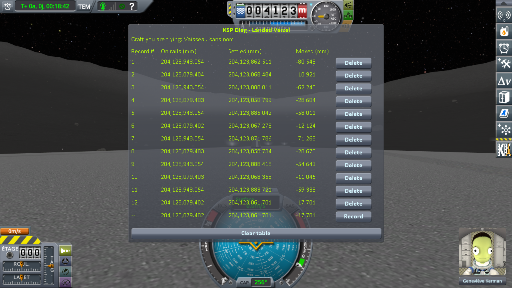

# The measurements: the runway and the grass beside it

Part of [KSP Diag - Landed Vessel](../README.md): the readings taken with
[the runway protocol](the-protocol-runway.md) — two identical craft, one on the grass and one on the
runway, 152 m apart, both read at each of six loadings of the same save; then the same on the Mun,
beside a runway placed by a mod. The other series are in
[The measurements: loading the same save](the-measurements-loading.md),
[The measurements: coming back to a craft you left](the-measurements-approach.md) and
[The measurements: switching to a craft far away](the-measurements-switching.md).

The save the protocol uses is [`diag/runway-kerbin.sfs`](../diag/runway-kerbin.sfs), and
[the protocol page](the-protocol-runway.md#the-save) says what it holds. The Mun series uses
[`diag/runway-mun-kk.sfs`](../diag/runway-mun-kk.sfs) and the two files beside it.

## The install

KSP 1.12.5 on Windows, with `GameData` holding Harmony, ModuleManager,
[KSP Community Fixes](https://github.com/KSPModdingLibs/KSPCommunityFixes) 1.41.1 and this mod, and
nothing else. For the Mun, [Kerbal Konstructs](https://github.com/KSP-RO/Kerbal-Konstructs) 1.12.3 is
added, with CustomPreLaunchChecks 1.8.1, which it requires.

## The readings

Six loadings on each body, two lines each: the odd lines on the ground, the even lines on the runway,
after switching to it. The bottom line of each screenshot is the reading in progress, not a record.

**On Kerbin**, the runway of the KSC and the grass beside it:

**On rails** reads 600,065,066.673 mm on the grass at all six loadings, and 600,069,387.065 or .066 mm
on the runway. **Settled**, in millimetres, and the step between the two craft:

| loading | on the grass | on the runway | **step**: runway minus grass |
|---|---|---|---|
| 1 | 600,065,136.222 | 600,069,424.941 | 4,288.719 |
| 2 | 600,065,047.966 | 600,069,339.381 | 4,291.415 |
| 3 | 600,065,134.857 | 600,069,413.261 | 4,278.404 |
| 4 | 600,065,118.295 | 600,069,469.656 | 4,351.361 |
| 5 | 600,065,109.776 | 600,069,379.479 | 4,269.703 |
| 6 | 600,065,104.880 | 600,069,399.786 | 4,294.906 |
| **lowest to highest** | **88.3 mm** | **130.3 mm** | **81.7 mm** |

In *Moved*, the craft on the grass goes from −18.707 to +69.549 mm, the craft on the runway from −47.685
to +82.590 mm.

**On the Mun**, a runway placed by Kerbal Konstructs and the ground 42 m from it:

**On rails** reads 204,123,943.054 mm on the ground at all six loadings, and 204,123,079.402 or .403 mm
on the runway. **Settled**, in millimetres, and the step between the two craft:

| loading | on the ground | on the runway | **step**: runway minus ground |
|---|---|---|---|
| 1 | 204,123,878.676 | 204,123,088.463 | −790.213 |
| 2 | 204,123,896.760 | 204,123,063.620 | −833.140 |
| 3 | 204,123,872.632 | 204,123,060.238 | −812.394 |
| 4 | 204,123,878.027 | 204,123,054.955 | −823.072 |
| 5 | 204,123,886.487 | 204,123,059.235 | −827.252 |
| 6 | 204,123,881.060 | 204,123,059.809 | −821.251 |
| **lowest to highest** | **24.1 mm** | **33.5 mm** | **42.9 mm** |

In *Moved*, the craft on the ground goes from −70.422 to −46.294 mm, the craft on the runway from
−24.447 to +9.061 mm.

## What these readings show

**The game hands all four craft back at the same height every time.** *On rails* does not move by more
than a thousandth of a millimetre on any of them, on Kerbin or on the Mun.

**All four come to rest somewhere else every time.** On Kerbin, the craft on the grass settles anywhere
within 88.3 mm, as in [the loading series](the-measurements-loading.md), and the craft on the runway
within 130.3 mm. On the Mun, 24.1 mm on the ground and 33.5 mm on the runway: smaller, as the Mun is
in the loading series too. Standing on a runway deck rather than on the terrain changes nothing to that.

**The runway and the ground do not move together.** The step between the two craft is never the same
twice: it spreads over 81.7 mm on Kerbin, 42.9 mm on the Mun. On Kerbin both craft stand on flat
ground, and the step, 4.3 m, is the height of the runway deck above the grass. On the Mun the ground
slopes, and the step is not the height of the deck. Either way, it is the same two craft on the same two
spots at every loading: if the runway kept the same height relative to the ground next to it, that
step would not move.

**Whether the game or a mod places it, a structure behaves the same.** The runway of the KSC, which the
game puts in place, and a runway Kerbal Konstructs puts on another body both come back at a different
height every time, and neither keeps its height relative to the ground next to it.

As everywhere else with this instrument, what is measured is **the craft**, not what they rest on —
[what this instrument shows, and what it does not](this-mods-demonstration.md#what-this-instrument-shows-and-what-it-does-not)
applies to these readings word for word.

## The logs

[`diag/runs/runway-stock.log`](../diag/runs/runway-stock.log) — the `KSP.log` of the session the six
loadings on Kerbin were taken in.

[`diag/runs/runway-mun-kk-stock.log`](../diag/runs/runway-mun-kk-stock.log) — the `KSP.log` of the
session the six loadings on the Mun were taken in.
