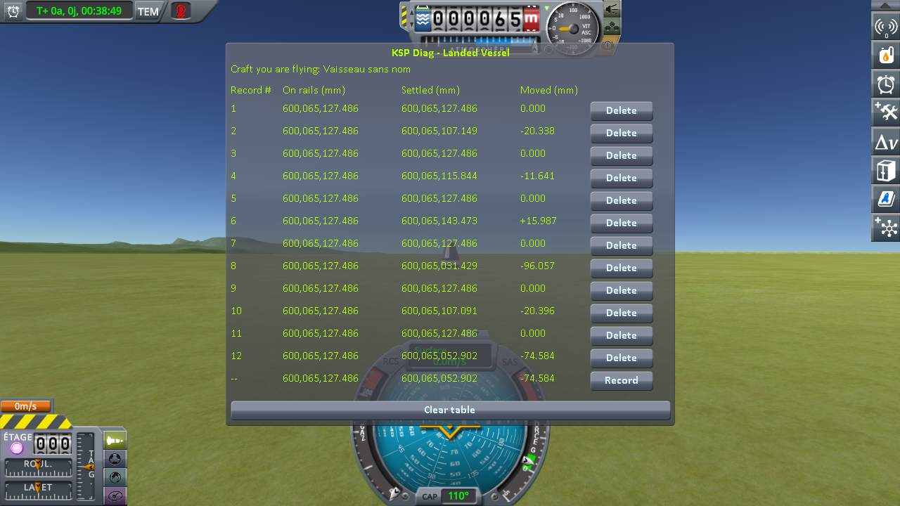

# The measurements: switching to a craft far away

Part of [KSP Diag - Landed Vessel](../README.md): the readings taken with
[the switching protocol](the-protocol-switching.md) — a capsule and a rover landed 1.97 km apart, the
save loaded while flying the rover, then the game's *switch vessel* key pressed to fly the capsule.

The save the protocol uses is [`diag/switch-kerbin.sfs`](../diag/switch-kerbin.sfs), and
[the protocol page](the-protocol-switching.md#the-save) says what it holds.

## The install

KSP 1.12.5 on Windows, with `GameData` holding Harmony, ModuleManager,
[KSP Community Fixes](https://github.com/KSPModdingLibs/KSPCommunityFixes) 1.41.1, this mod,
[KSP Diag - Terrain Height](https://github.com/lhervier/KSP-Diag-TerrainHeight), which reads the ground
under the capsule at the same moments, and [KSP-MCPServer](https://github.com/lhervier/KSP-MCPServer),
which plays the protocol, and nothing else.

The six rounds were played by [the script of the protocol](the-protocol-switching.md#played-by-a-script),
`run-switching.py`, in a single session.

## The readings

Six rounds, two lines each: the first recorded as the save opens, flying the rover, the second a few
seconds after switching to the capsule. The bottom line of the screenshot is the reading in progress,
not a record.

| round | **On rails** (mm) | **Settled** after the switch (mm) | **Moved** |
|---|---|---|---|
| 1 | 600,065,127.486 | 600,065,107.149 | **−20.338 mm** |
| 2 | 600,065,127.486 | 600,065,115.844 | **−11.641 mm** |
| 3 | 600,065,127.486 | 600,065,143.473 | **+15.987 mm** |
| 4 | 600,065,127.486 | 600,065,031.429 | **−96.057 mm** |
| 5 | 600,065,127.486 | 600,065,107.091 | **−20.396 mm** |
| 6 | 600,065,127.486 | 600,065,052.902 | **−74.584 mm** |
| **lowest to highest** | **0.000 mm** | **112.0 mm** | |

The first line of every round, recorded as the save opens, reads `0.000` in *Moved*: the capsule is
still held where the save put it, with nothing to move it yet.

**→ What they show: [What the measurements show: switching to a craft far away](what-the-measurements-show-switching.md)**

## The logs

[`diag/runs/switching-stock.log`](../diag/runs/switching-stock.log) — the `KSP.log` of the session
the six rounds were taken in; what the script printed is in
[`switching-stock-script.txt`](../diag/runs/switching-stock-script.txt), and every line it recorded,
in both instruments, in [`switching-stock-lines.json`](../diag/runs/switching-stock-lines.json).
