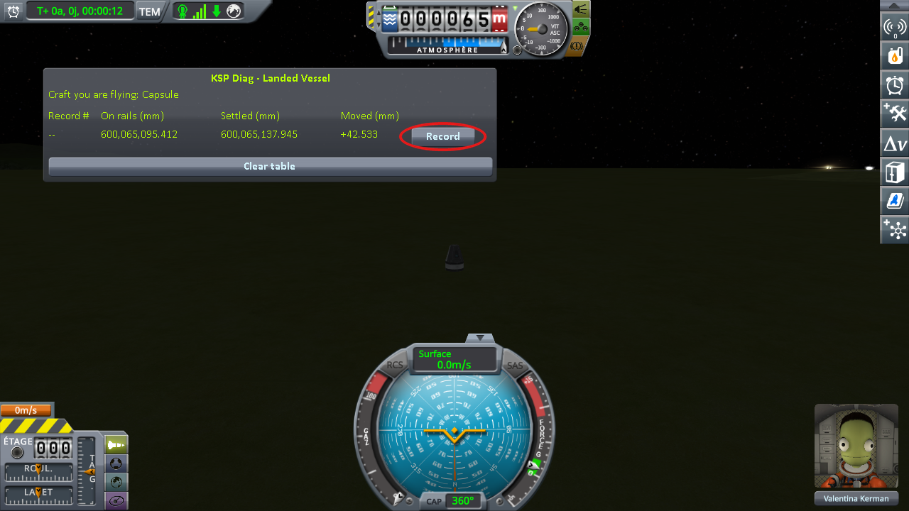
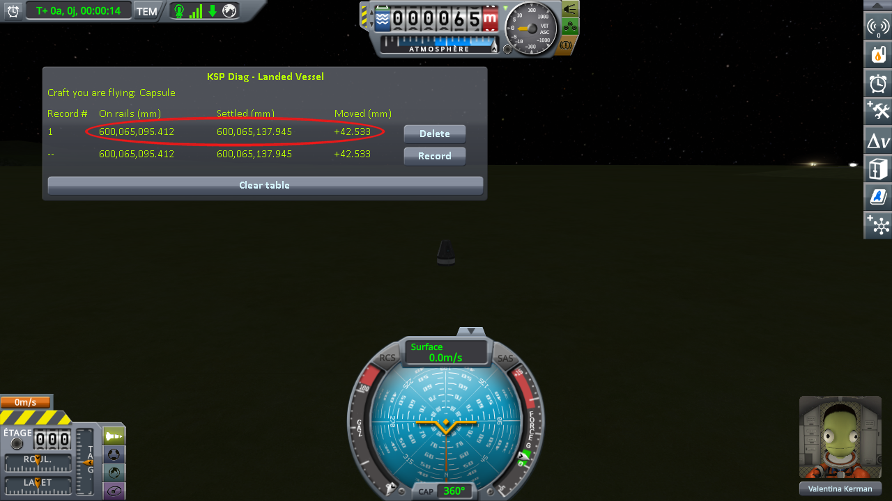
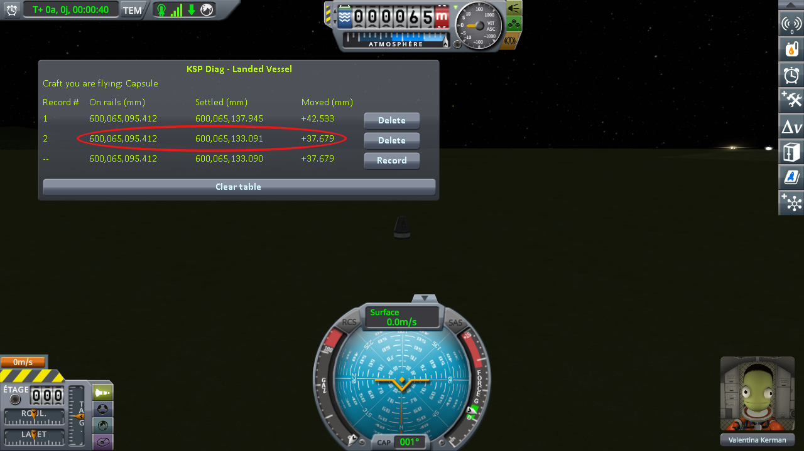
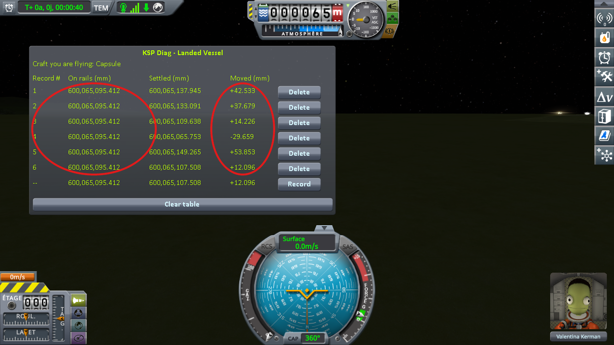

# The protocol: loading the same save

Part of [KSP Diag - Landed Vessel](../README.md): how to take the reading on a craft that comes
back with a save, step by step. The columns it fills are in [The window](the-window.md), and what it
reads is in [The measurements: loading the same save](the-measurements-loading.md).

**1. Launch a capsule on a small flat fuel tank** — two parts, no anchor, no wheels, no landing legs.
Not a lone capsule: KSP treats a craft made of a single part apart, and puts it back onto the ground
itself at every loading, which would mix its own move with the ground's.

(The probe window is draggable — drop it wherever it does not get in the way.)

**2. Move it off onto bare ground.** `Alt+F12 → Cheats → Set Position`. Tick *Use middle click to set
position*, then middle-click a patch of grass just off the end of the runway. No need to go far — the
KSC apron is conveniently flat — but you do have to be off the tarmac itself.

⚠️ **Not on the launchpad and not on the runway.** It works there too — the numbers move just the
same. The trouble is that they no longer say what moved. The launchpad and the runway are structures,
not ground: KSP puts them in place its own way, and the runway's height has a wobble of its own, which
does not follow the ground's — [The measurements: the runway and the grass beside it](the-measurements-runway.md).
A reading taken there is about the structure, not the ground. On bare terrain there is only one thing
under the craft.

⚠️ **And KSP must not move the craft itself.** At loading, KSP may run a pass that sets a landed craft
back onto the ground before its physics starts. It moves the craft only when it finds it more than
10 cm off, and then writes a line `ground contact! - error. Moving Vessel` naming your craft, right
before `Unpacking`, in `KSP.log`. The reading then mixes that move with the ground's: a loading with
that line does not count.

⚠️ **And the craft must not slide.** A landed craft at rest is held in place by the game, but only
while its throttle is closed. Open it, even by a few percent, even on a craft with no engine, and
nothing holds the craft any more: on a slope it slides slowly downhill, a fraction of a millimetre per
second, and its height goes down as it slides. **Settled** then never stops moving, and **Moved** only
tells you how long you waited before pressing *Record*. The throttle stays where you left it: a single
press of Shift is enough, and only `X` closes it again. So a spot is only good if both hold: no
`Moving Vessel` line in `KSP.log`, and a **Settled** value that stops moving once the craft has come
to rest. Flat ground makes both easy.

Note that on some of the screenshots of this page, the throttle gauge left of the navball is not at zero:
they were taken with Shift+Win+S, and its Shift opened the throttle. Take yours with F1 or Print
Screen, which leave the throttle alone.

**3. Let it settle, and save once.**

If you pressed *Record* before saving — out of curiosity, while placing the craft — delete that
line now. It was taken before the save existed, so its **On rails** value is the launch position and
does not belong in the same column as the others.

**4. Load that same save.**

**5. Watch the live line until it stops moving, then press *Record* at the end of it.**

The first line appears. **On rails** is the height the save gave back, **Settled** the height the
craft actually came to rest at, and **Moved** the difference — already not zero.

**6. Load the same save again.** Not a new save: the one from step 3, again.

**7. Settle, record again.** A second line appears, under the first.

**8. Repeat steps 6 and 7** until you have five or six lines.

⚠️ **Never save again until the campaign is over.** Saving each time would write a new position every
time, and you would be measuring your own round trip on top of the ground.

Now read the table. If there were nothing wrong, it would read like this: **On rails** the same value
on every line — KSP handing the craft back exactly where it left it, loading after loading — and
**Moved** zero on every line, because the craft was set down on the ground and has nothing left to
do.

Half of that holds. **On rails** comes back to within a thousandth of a millimetre, so the save and
reload round trip is exact and the craft really is put back where it was. **Moved** is not zero on
a single line, and it is not small either.

## Played by a script

[`diag/automation/run-loading.py`](../diag/automation/run-loading.py) plays steps 4 to 8 above, on
[a save already made](../diag/README.md#the-saves-of-the-loading-protocol), and takes the screenshot. It drives KSP through
[KSP-MCPServer](https://github.com/lhervier/KSP-MCPServer), a mod that answers requests sent to it over
HTTP, from the computer KSP runs on only; and it needs nothing but Python 3 — no AI, no package to
install. Anyone can read it top to bottom: it follows the steps above in the same order.

The saves it was played on are in [`diag`](../diag/README.md#the-saves-of-the-loading-protocol), made
by steps 1 to 3 on each of the four worlds of stock KSP, a capsule on a small flat fuel tank:
`reload-kerbin-2parts.sfs`, and the same for `mune`, `minmus` and `gilly`. Each was checked against the rules of step 2: no `Moving Vessel` line in
`KSP.log`, and a craft that does not slide. On Real Solar System, it was played on the Moon and on Earth, on
[`reload-moon-rss-resave.sfs`](../diag/reload-moon-rss-resave.sfs) and
[`reload-earth-rss-resave.sfs`](../diag/reload-earth-rss-resave.sfs), a capsule on an empty fuel tank;
these load only on the install described in [On Real Solar System](../diag/README.md#on-real-solar-system).

1. Install KSP-MCPServer next to this mod, copy the save into a sandbox game, start KSP and wait for
   the main menu.
2. Run `python run-loading.py --folder <your sandbox game> --save reload-kerbin-2parts --loads 6 --out screenshots`.

For each loading, it loads the save, waits for the digits to stop moving (within half a thousandth of a
millimetre over two seconds), and records. If
[KSP Diag - Terrain Height](https://github.com/lhervier/KSP-Diag-TerrainHeight) is installed as well,
it records in both windows at the same moment. It never saves the game. After the last loading it takes
a screenshot of each table, prints every line it recorded, writes them to `lines.json` next to the
screenshots, and quits KSP — give it `--keep-running` to leave KSP open. Save `KSP.log` before starting
KSP again: KSP writes it anew at every start.
