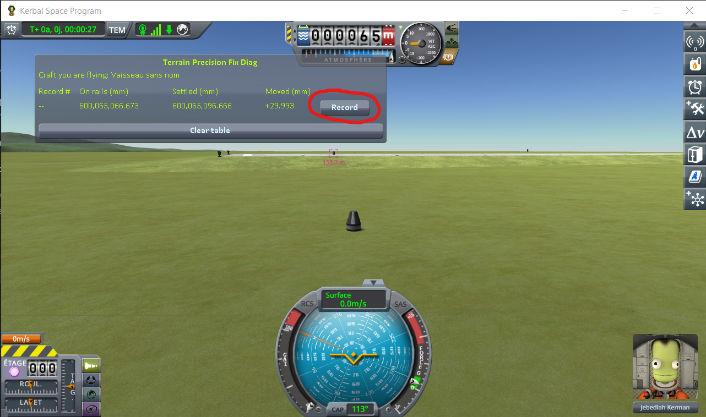
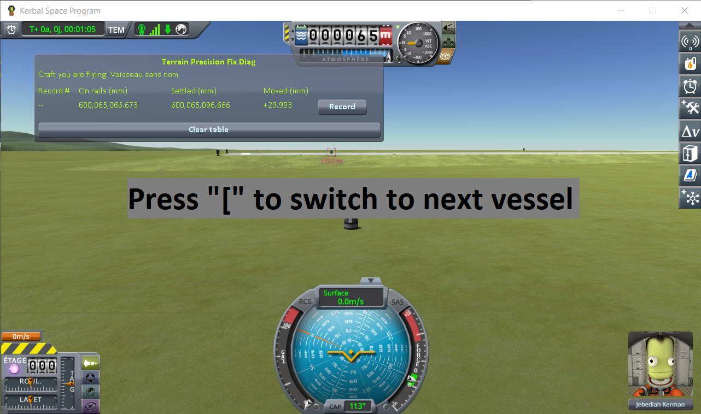
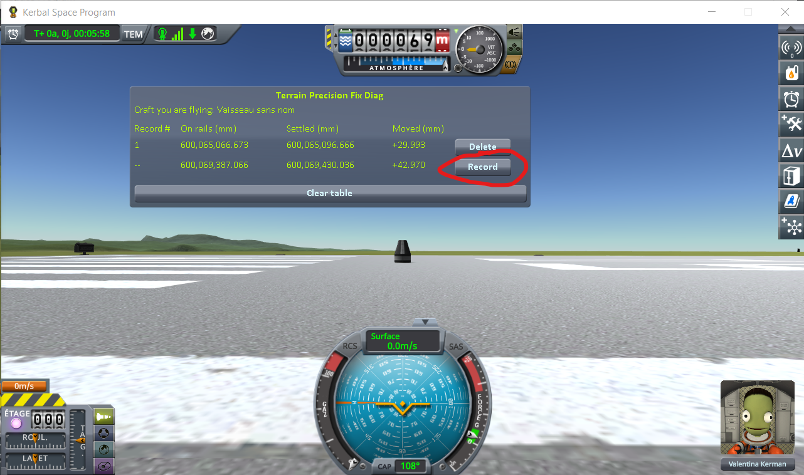

# The protocol: the runway and the grass beside it

Part of [Terrain Precision Fix Diag 1](../README.md): how to take the reading on a craft parked on the
runway, where [the loading protocol](the-protocol-loading.md) tells you not to go. The columns it fills
are in [The window](the-window.md), and what it reads is in
[The measurements: the runway and the grass beside it](the-measurements-runway.md).

A craft on the runway rests on the runway deck, a structure the game puts in place its own way, not on
the terrain. One craft there would only say that it comes back at a different height at every loading.
So this protocol parks **two identical craft**, one on the runway and one on the grass beside it, and
reads both at every loading. The ground around the KSC is flat, and both craft are the same: once they
have come to rest, the difference between their heights is the step between the grass and the runway
deck. If the runway kept the same height relative to the ground next to it, that step would be the same
at every loading.

## The save

[`runway-kerbin.sfs`](../diag/runway-kerbin.sfs), a sandbox game of KSP 1.12.5. Copy it into the
folder of a sandbox game and load it from that game. It holds two identical craft, each a Mk1 command
pod on an empty FL-T100 tank:

- **on the grass**, landed at latitude −0.0629°, longitude −74.7277°. It is the craft you are flying
  when the save opens;
- **on the runway**, 152 m away, where the game puts a craft launched from the Spaceplane Hangar:
  latitude −0.0488°, longitude −74.7243°.

No target is set. Keep it that way: the window reads the target when there is one, and every line would
then read the same craft.

You can make your own instead: launch the craft from the Spaceplane Hangar, move it onto the grass
beside the runway with `Alt+F12 → Cheats → Set Position`, launch the same craft a second time and leave
it on the runway, then save once. Each craft must meet the conditions of
[the capsule of the loading protocol](the-protocol-loading.md): no suspension, nothing that needs a slope
to move on its own.

## The protocol

**1. Load the save.** You are flying the craft on the grass. Wait for **Settled** to stop moving, then
press *Record*.

**2. Switch to the craft on the runway** with `[`, one of the game's two default *switch vessel* keys.

Give it three to five seconds, then press *Record*.

**3. Load the same save again**, and repeat steps 1 and 2 — six times in all, two lines each time,
always in the same order.

⚠️ **Do not touch the throttle** of either craft. Throttling up frees a landed craft from what holds it
in place, and the next line would be measuring that.

⚠️ **Never save over the save you load.** It is what holds the heights both craft are handed back at,
and every loading must start from those same heights.

One loading says nothing on its own: it is the series that is worth reading, not a line.
